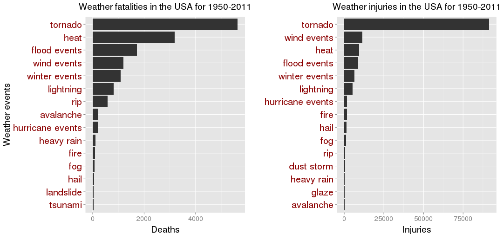
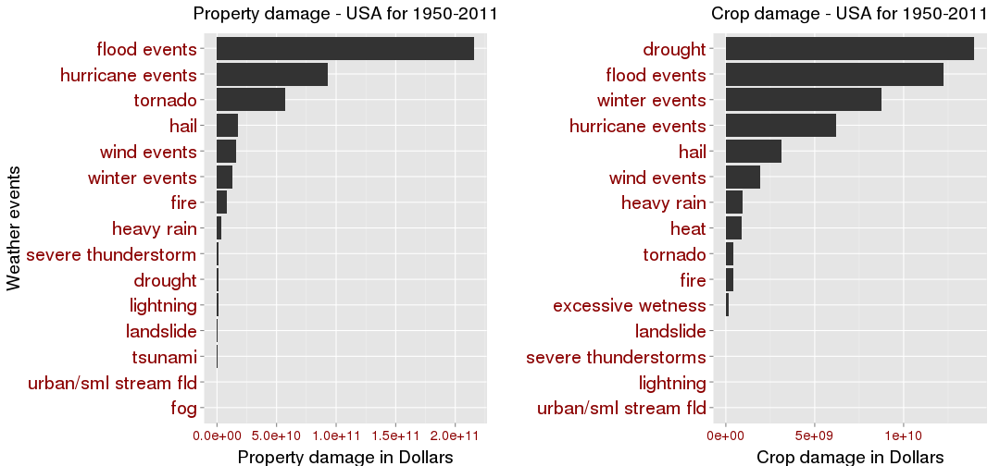

# Analysis of major storm and weather events in 
# the USA from 1950--2011

## Synopsis

The U.S. National Oceanic and Atmospheric Administration's (NOAA) [storm database](https://d396qusza40orc.cloudfront.net/repdata%2Fdata%2FStormData.csv.bz2)
was used to compare outcomes from storm and severe weather event categories.
Analyzed data are from 1950--2011.
Outcomes analyzed are the number of fatalities and injuries and the dollar
amount of property damage.
Event categories are for example winter events, hurricane events, wind
events, heat, tornado, flood events. The second name 'events' is
indicator that multiple events with different names but similar behaviour
are grouped as name of the dominant event + event name. Wind type is exception.

The results of analysis are shown in tables and plots. The key of analysis
is find the most influential event types for fatalities, injuries,
property and crop damage.


## Data Processing

### 1. Read data file

The data file (bz2) is in the working directory.
Read the bz2 file as csv, select columns by col_names and convert data
frame to data.table


```r
library(data.table)
```

```
## data.table 1.9.3  For help type: help("data.table")
```

```r
library(plyr)
library(gridExtra)
```

```
## Loading required package: grid
```

```r
library(ggplot2)

col_names <- c("EVTYPE","FATALITIES","INJURIES","PROPDMG","PROPDMGEXP","CROPDMG","CROPDMGEXP")
# data <- data.table(read.csv(bzfile("./repdata_data_StormData.csv.bz2"))[,col_names])
data <- fread("./Storm_data.csv")
```
### 2. Lower case the column names and evtype, show how much are event names repeating


```r
# Change the column names to lower case
setnames(data, tolower(names(data)))

# Change all event names in evtype column to lower case
data[,evtype := tolower(evtype)][1:5]
```

```
##     evtype fatalities injuries propdmg propdmgexp cropdmg cropdmgexp
## 1: tornado          0       15    25.0          K       0           
## 2: tornado          0        0     2.5          K       0           
## 3: tornado          0        2    25.0          K       0           
## 4: tornado          0        2     2.5          K       0           
## 5: tornado          0        2     2.5          K       0
```

```r
# How much are the names repetitive in the evtype column? 
arrange(data[, .N, by = evtype], desc(N))[1:40]
```

```
##                       evtype      N
##  1:                     hail 288661
##  2:                tstm wind 219942
##  3:        thunderstorm wind  82564
##  4:                  tornado  60652
##  5:              flash flood  54277
##  6:                    flood  25327
##  7:       thunderstorm winds  20843
##  8:                high wind  20214
##  9:                lightning  15754
## 10:               heavy snow  15708
## 11:               heavy rain  11742
## 12:             winter storm  11433
## 13:           winter weather   7045
## 14:             funnel cloud   6844
## 15:         marine tstm wind   6175
## 16: marine thunderstorm wind   5812
## 17:               waterspout   3796
## 18:              strong wind   3569
## 19:     urban/sml stream fld   3392
## 20:                 wildfire   2761
## 21:                 blizzard   2719
## 22:                  drought   2488
## 23:                ice storm   2006
## 24:           excessive heat   1678
## 25:               high winds   1533
## 26:         wild/forest fire   1457
## 27:             frost/freeze   1343
## 28:                dense fog   1293
## 29:       winter weather/mix   1104
## 30:           tstm wind/hail   1028
## 31:  extreme cold/wind chill   1002
## 32:                     heat    767
## 33:                high surf    734
## 34:           tropical storm    690
## 35:           flash flooding    682
## 36:             extreme cold    657
## 37:            coastal flood    656
## 38:         lake-effect snow    636
## 39:        flood/flash flood    625
## 40:                     snow    617
##                       evtype      N
```

```r
# How much are the specific event names repetitive?
arrange(data[grep("wind", evtype), .N, by = evtype], desc(N))[1:20]
```

```
##                       evtype      N
##  1:                tstm wind 219942
##  2:        thunderstorm wind  82564
##  3:       thunderstorm winds  20843
##  4:                high wind  20214
##  5:         marine tstm wind   6175
##  6: marine thunderstorm wind   5812
##  7:              strong wind   3569
##  8:               high winds   1533
##  9:           tstm wind/hail   1028
## 10:  extreme cold/wind chill   1002
## 11:          cold/wind chill    539
## 12:                     wind    346
## 13:             strong winds    204
## 14:        extreme windchill    204
## 15:         marine high wind    135
## 16:              gusty winds     65
## 17:  thunderstorm winds hail     61
## 18:      thunderstorm windss     51
## 19:       marine strong wind     48
## 20:          tstm wind (g45)     39
```

```r
arrange(data[grep("flood", evtype), .N, by = evtype], desc(N))[1:20]
```

```
##                       evtype     N
##  1:              flash flood 54277
##  2:                    flood 25327
##  3:           flash flooding   682
##  4:            coastal flood   656
##  5:        flood/flash flood   625
##  6:              urban flood   251
##  7:         coastal flooding   183
##  8:              river flood   173
##  9:                 flooding   120
## 10:           urban flooding    99
## 11:             flash floods    32
## 12: urban/small stream flood    30
## 13:           river flooding    29
## 14:           tidal flooding    25
## 15:          lakeshore flood    23
## 16:        flash flood/flood    22
## 17:     heavy rains/flooding     9
## 18:     flash flooding/flood     8
## 19:       small stream flood     7
## 20:         flood/rain/winds     6
```
### 3. Join the most influential events within evtype column

I try to join similar names of the most influential source of events and in
addition join the names of events with similar behaviour but different (not similar) names. 
The first name of every string in the events list will be the representing name in evtype 
column for all names in the string. This is done through gsub function.


```r
events <- list("heavy rain|rain", "winter events|winter|frost|cold|snow|freez|ice|blizzard", 
    "hurricane events|hurricane|typhoon|tropical|waterspout", "heat|warm", "hail", 
    "flood events|flood|surf|surge", "wind events|wind", "tornado", "rip", "fog", "fire")

# This is a very complex line that deal with data, grep every element of list events within data 
# column evtype and assing this grep variables to evtype as the first name from events string
# through gsub function. The solution is within the data because data.table package (different than data.frame).
tmp <- lapply(events, function(x) data[grep(x, evtype), evtype := gsub("\\|+[a-z]+", "", x)])

data
```

```
##                evtype fatalities injuries propdmg propdmgexp cropdmg
##      1:       tornado          0       15    25.0          K       0
##      2:       tornado          0        0     2.5          K       0
##      3:       tornado          0        2    25.0          K       0
##      4:       tornado          0        2     2.5          K       0
##      5:       tornado          0        2     2.5          K       0
##     ---                                                             
## 902293:   wind events          0        0     0.0          K       0
## 902294:   wind events          0        0     0.0          K       0
## 902295:   wind events          0        0     0.0          K       0
## 902296: winter events          0        0     0.0          K       0
## 902297: winter events          0        0     0.0          K       0
##         cropdmgexp
##      1:           
##      2:           
##      3:           
##      4:           
##      5:           
##     ---           
## 902293:          K
## 902294:          K
## 902295:          K
## 902296:          K
## 902297:          K
```

```r
data[grep("wind", evtype), .N, by = evtype]
```

```
##         evtype      N
## 1: wind events 362149
```

```r
data[grep("flood", evtype), .N, by = evtype]
```

```
##          evtype     N
## 1: flood events 84159
```

### 4. The most harmful events with respect to population health

Subset sum of injuries and fatalities by evtype and show ordered subset data. 


```r
harm_sum <- data[, list(fatal = sum(fatalities), injur = sum(injuries)), by = evtype]
fatal <- harm_sum[order(-fatal), fatal, evtype][1:15]
fatal
```

```
##               evtype fatal
##  1:          tornado  5633
##  2:             heat  3178
##  3:     flood events  1714
##  4:      wind events  1188
##  5:    winter events  1081
##  6:        lightning   816
##  7:              rip   572
##  8:        avalanche   224
##  9: hurricane events   207
## 10:       heavy rain   114
## 11:             fire    90
## 12:              fog    80
## 13:             hail    45
## 14:        landslide    38
## 15:          tsunami    33
```

```r
injur <- harm_sum[order(-injur), injur, evtype][1:15]
injur
```

```
##               evtype injur
##  1:          tornado 91364
##  2:      wind events 11304
##  3:             heat  9243
##  4:     flood events  8891
##  5:    winter events  6352
##  6:        lightning  5230
##  7: hurricane events  1788
##  8:             fire  1608
##  9:             hail  1467
## 10:              fog  1076
## 11:              rip   529
## 12:       dust storm   440
## 13:       heavy rain   305
## 14:            glaze   216
## 15:        avalanche   170
```
### 5. The events of greatest economic consequences 

#### 5.1 The property damage


```r
# create data table for merging propdmgexp
prop_token <- data.table(propdmgexp = c("K", "M", "B"), dollars = as.numeric(c("1000", "10e5", "10e8")))

# merge and convert propdmgexp tokens into dollars
prop_merge <- merge(prop_token, data, by = "propdmgexp")

prop_merge
```

```
##         propdmgexp dollars           evtype fatalities injuries propdmg
##      1:          B   1e+09    winter events          4        0     5.0
##      2:          B   1e+09 hurricane events          2        0     0.1
##      3:          B   1e+09 hurricane events          1        0     2.1
##      4:          B   1e+09             hail         25        0     1.6
##      5:          B   1e+09 hurricane events          0        0     1.0
##     ---                                                                
## 436031:          M   1e+06     flood events          0        0     1.0
## 436032:          M   1e+06     flood events          0        0    24.0
## 436033:          M   1e+06          tornado          0        2     4.0
## 436034:          M   1e+06    winter events          0        0     1.0
## 436035:          M   1e+06    winter events          0        0     1.0
##         cropdmg cropdmgexp
##      1:     0.0           
##      2:    10.0          M
##      3:     5.0          M
##      4:     2.5          M
##      5:     0.0           
##     ---                   
## 436031:     0.0          K
## 436032:     0.0          K
## 436033:     0.0          K
## 436034:     0.0          K
## 436035:     0.0          K
```

```r
#####################################################################################
#  ALTERNATIVE 1

# prop_merge <- merge(setkey(prop_token, propdmgexp), setkey(data, propdmgexp))

# ALTERNATIVE 2 (in one line) 

# prop_merge_alt<- data[propdmgexp %like% "K|M|B", list(evtype, prop = ifelse(propdmgexp == "B", propdmg * 1e+09, ifelse(propdmgexp == 
#    "M", propdmg * 1e+06, ifelse(propdmgexp == "K", propdmg * 1000, na.omit(propdmg)))))]

# AND SUM BY EVTYPE

# prop_merge_alt[, list(prop = sum(prop)), by = evtype]
#####################################################################################

prop_sum <- prop_merge[, list(prop = sum(propdmg * dollars)), by = evtype]

######################################################################################
#  ALTERNATIVE

# prop_sum <- ddply(prop_merge[, prop := propdmg * dollars], .(evtype), summarize, prop = sum(prop))
######################################################################################

prop <- prop_sum[order(-prop)][1:15]
prop
```

```
##                   evtype      prop
##  1:         flood events 2.156e+11
##  2:     hurricane events 9.311e+10
##  3:              tornado 5.693e+10
##  4:                 hail 1.762e+10
##  5:          wind events 1.579e+10
##  6:        winter events 1.270e+10
##  7:                 fire 8.502e+09
##  8:           heavy rain 3.270e+09
##  9:  severe thunderstorm 1.205e+09
## 10:              drought 1.046e+09
## 11:            lightning 9.287e+08
## 12:            landslide 3.246e+08
## 13:              tsunami 1.441e+08
## 14: urban/sml stream fld 5.831e+07
## 15:                  fog 2.283e+07
```

#### 5.2 The crop damage


```r
crop_token <- data.table(cropdmgexp = c("K", "M", "B"), dollars = as.numeric(c("1000", "10e5", "10e8")))
crop_merge <- merge(crop_token, data, by = "cropdmgexp")
crop_sum <- crop_merge[, list(crop = sum(cropdmg * dollars)), by = evtype]
crop <- crop_sum[order(-crop)][1:15]
crop
```

```
##                   evtype      crop
##  1:              drought 1.397e+10
##  2:         flood events 1.226e+10
##  3:        winter events 8.735e+09
##  4:     hurricane events 6.201e+09
##  5:                 hail 3.114e+09
##  6:          wind events 1.956e+09
##  7:           heavy rain 9.193e+08
##  8:                 heat 9.045e+08
##  9:              tornado 4.150e+08
## 10:                 fire 4.033e+08
## 11:    excessive wetness 1.420e+08
## 12:            landslide 2.002e+07
## 13: severe thunderstorms 1.700e+07
## 14:            lightning 1.209e+07
## 15: urban/sml stream fld 8.488e+06
```
## Results


```r
f <- ggplot(fatal, aes(x = reorder(evtype, fatal), y = fatal)) + geom_bar(stat = "identity") + coord_flip() +
theme(axis.text.y = element_text(size=20,color="darkred"), text = element_text(size=19), axis.title.y = element_text(vjust = 1.0), 
      axis.title.x = element_text(vjust = -0.6), plot.title = element_text(size = 19, vjust = 2)) +
labs(y = "Deaths", x = "Weather events") + ggtitle("Weather fatalities in the USA for 1950-2011")

i <- ggplot(injur, aes(x = reorder(evtype, injur), y = injur)) + geom_bar(stat = "identity") + coord_flip() +
theme(axis.text.y = element_text(size=20,color="darkred"), text = element_text(size=19), axis.title.y = element_text(vjust = 1.0), 
      axis.title.x = element_text(vjust = -0.6), plot.title = element_text(size = 19, vjust = 2)) +
labs(y = "Injuries", x = "") + ggtitle("Weather injuries in the USA for 1950-2011")

grid.arrange(f, i, ncol = 2)
```

 

```r
p <- ggplot(prop, aes(x = reorder(evtype, prop), y = prop)) + geom_bar(stat = "identity") + coord_flip() +
theme(axis.text.y = element_text(size=20,color="darkred"), axis.text.x = element_text(size=15, color="darkred"), text = element_text(size=19), 
      axis.title.y = element_text(vjust = 1.0), axis.title.x = element_text(vjust = -0.6), plot.title = element_text(size = 19, vjust = 2)) +
labs(y = "Property damage in Dollars", x = "Weather events") + ggtitle("Property damage - USA for 1950-2011")

c <- ggplot(crop, aes(x = reorder(evtype, crop), y = crop)) + geom_bar(stat = "identity") + coord_flip() +
theme(axis.text.y = element_text(size=20,color="darkred"), axis.text.x = element_text(size=15, color="darkred"), text = element_text(size=19), 
      axis.title.y = element_text(vjust = 1.0), axis.title.x = element_text(vjust = -0.6), plot.title = element_text(size = 19, vjust = 2)) +
labs(y = "Crop damage in Dollars", x = "") + ggtitle("Crop damage - USA for 1950-2011")

grid.arrange(p, c, ncol = 2)
```

 
